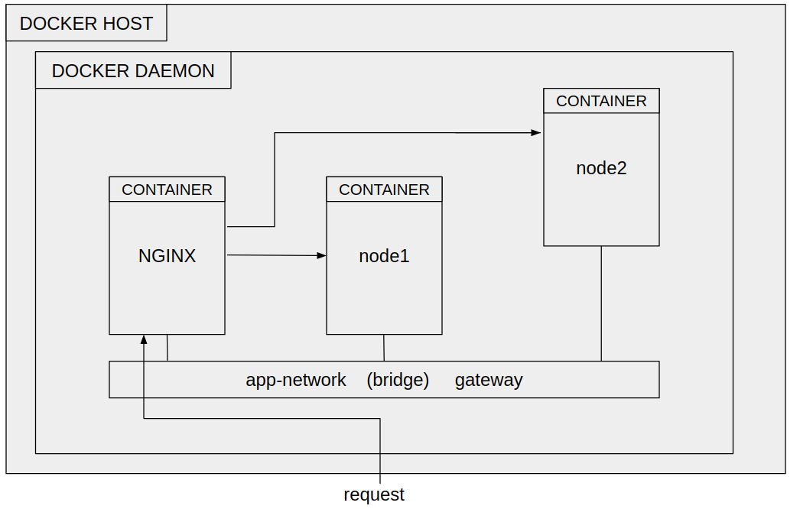

# Отчет по проектно-технологической практике 
Разработка изолированных приложений при помощи технологий контейнеризации на примере балансировщика нагрузки.

Выполнили:
* Белозор А.М. - написание веб-сервера и Dockerfile для него 
* Мордвинов Е.Ю. - написание конфигурации и Dockerfile для NGINX
* Терентьев Д.А. - написание docker-compose файла

### Используемый стек:
1. NodeJS+ExpressJS для создания веб-серверов между которыми будет происходить балансировка нагрузки.
2. NGINX для создания балансировщика нагрузки.
3. Docker+Docker Compose для контейнеризации приложений.

### Запуск проекта:
```
sudo docker-compose up --build -d
```
### Проверка
1. Открыть браузер по адресу http://localhost:8080/ и обновить страницу несколько раз.
2. Проверить записи логов зайдя внутрь контейнера
```
sudo docker exec -it loadbalancer-node-docker_nginx_1 bash
```
и посмотрев файл
```
tail -f var/log/nginx/lbaccess.log
```
Пример лог файла:
```
Request was made on: localhost then redirected from: 172.21.0.1 through NGINX load balancer: 172.21.0.4 to: 172.21.0.2:5000 with method [GET / HTTP/1.1] and respons code: 200
Request was made on: localhost then redirected from: 172.21.0.1 through NGINX load balancer: 172.21.0.4 to: 172.21.0.3:5000 with method [GET / HTTP/1.1] and respons code: 200
Request was made on: localhost then redirected from: 172.21.0.1 through NGINX load balancer: 172.21.0.4 to: 172.21.0.2:5000 with method [GET / HTTP/1.1] and respons code: 200
```

### Общее описание

Архитектура проекта представлена на рисунке выше. В ходе выполнения задания и создания контейнеров с приложниями, объединенных балансировщиком нагрузки, были выполнены следующие шаги:
1. Написание базового приложения NodeJS с применением ExpressJS для веб-сервера (папка /app) для отображения простого сообщения привествия `Hello ${name}!`, переменная `name` передается при создании контейнера . Так как данное приложение будет в Docker контейнере, то необходимо создать Dockerfile, в котором описан используемый базовый образ node, происходит копирование файлов packege.json (описание необходимых зависимостей) и index.js (сам веб-сервер), установка зависимостей, открытие порта и запуск веб-сервера.
2. Подготовка конфигурационного файла для NGINX (папка /nginx) под задачи балансировки нагрузки между двумя контенерами с веб-приложениями, который содержит описанное правило балансировки(round robin) и шаблон для записи событий в лог файл. Это приложение также будет находиться в Docker контейнере,  изображение которого описано в Dockerfile, который содержит базовый образ nginx, копирование конфигурационного файла и открытие порта.
3. Написание docker-compose файла для совместного запуска сразу нескольких контейнеров: 2 c веб-приложениями и 1 с балансировщиком нагрузки. Данный файл содержит определение сервисов(контейнеров) node1 и node2, которые создаются на основе Dockerfile для веб-приложений, с определением переменной окружения как node1 и node2 соответственно. Также определен сервис для nginx, созданный на основе Dockerfile для балансировщика нагрузки, открыты порты для доступа к нему с хоста и создана связь с сервисами веб-приложений. Все сервисы объединены в одной пользовательской сети app-network.
